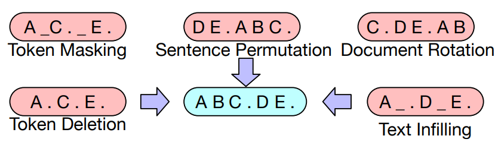
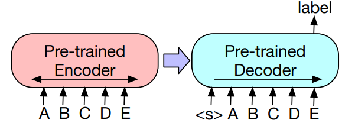

<a href="https://github.com/psf/black"></a>

## BART(**B**idirectional and **A**uto**R**egressive **T**ransformer)



Pretrained KoBART 모델을 활용하여 분류 태스크를 수행합니다. BART는 encoder-decoder 구조를 가지며 text-infilling objective로 pretraining 합니다. sequence classification 태스크에 적용하기 위해서는 아래 그림과 같이 encoder와 decoder에 동일하게 분류하고자 하는 sequence를 넣어주고, decoder의 마지막 단어의 last hidden state를 활용하여 분류합니다. 분류 layer는 `FFNN + Softmax`입니다.



### How to Run

- 가상환경 세팅
```
pip install -r requirements.txt # pip을 이용하는 경우
```
```
conda env create --file environment.yml # conda를 이용하는 경우 
```


- binary dataset으로 분류기 학습하기
```
python train_advanced.py [ binary | multi_class ]
```
```
dropping 1 samples due to nan values...
dropping 0 samples due to nan values...
Ep 1, tr_loss=0.942, val_loss=None, val_acc=None:   6%|███████                                                                                                                     | 9/157 [00:21<04:59,  2.02s/it]reached best val loss of 0.764, saving states...
Ep 1, tr_loss=0.721, val_loss=0.764, val_acc=0.500:  12%|██████████████▋                                                                                                          | 19/157 [01:11<05:18,  2.31s/it]reached best val loss of 0.721, saving states...
Ep 1, tr_loss=0.690, val_loss=0.721, val_acc=0.500:  18%|██████████████████████▎                                                                                                  | 29/157 [02:02<04:56,  2.32s/it]reached best val loss of 0.695, saving states...
Ep 1, tr_loss=0.732, val_loss=0.695, val_acc=0.513:  25%|██████████████████████████████                                                                                           | 39/157 [02:53<04:31,  2.30s/it]reached best val loss of 0.694, saving states...
Ep 1, tr_loss=0.657, val_loss=0.694, val_acc=0.528:  31%|█████████████████████████████████████▊                                                                                   | 49/157 [03:44<04:11,  2.33s/it]reached best val loss of 0.677, saving states...
Ep 1, tr_loss=0.631, val_loss=0.677, val_acc=0.574:  38%|█████████████████████████████████████████████▍                                                                           | 59/157 [04:35<03:44,  2.29s/it]reached best val loss of 0.642, saving states...
Ep 1, tr_loss=0.500, val_loss=0.656, val_acc=0.673:  50%|████████████████████████████████████████████████████████████▉                                                            | 79/157 [06:13<02:56,  2.27s/it]reached best val loss of 0.557, saving states...
Ep 1, tr_loss=0.455, val_loss=0.557, val_acc=0.719:  57%|████████████████████████████████████████████████████████████████████▌                                                    | 89/157 [07:03<02:39,  2.35s/it]reached best val loss of 0.546, saving states...
Ep 1, tr_loss=0.392, val_loss=0.548, val_acc=0.728:  69%|███████████████████████████████████████████████████████████████████████████████████▎                                    | 109/157 [08:40<01:46,  2.22s/it]reached best val loss of 0.479, saving states...
Ep 1, tr_loss=0.411, val_loss=0.479, val_acc=0.775:  76%|██████████████████████████████████████████████████████████████████████████████████████████▉                             | 119/157 [09:33<01:27,  2.30s/it]reached best val loss of 0.455, saving states...
Ep 1, tr_loss=0.411, val_loss=0.455, val_acc=0.793:  82%|██████████████████████████████████████████████████████████████████████████████████████████████████▌                     | 129/157 [10:23<01:05,  2.32s/it]reached best val loss of 0.452, saving states...
Ep 1, tr_loss=0.350, val_loss=0.466, val_acc=0.773:  95%|█████████████████████████████████████████████████████████████████████████████████████████████████████████████████▉      | 149/157 [12:01<00:18,  2.29s/it]reached best val loss of 0.423, saving states...
Ep 1, tr_loss=0.299, val_loss=0.423, val_acc=0.822: 100%|████████████████████████████████████████████████████████████████████████████████████████████████████████████████████████| 157/157 [12:45<00:00,  4.88s/it]
Ep 2, tr_loss=0.309, val_loss=0.466, val_acc=0.803:  14%|████████████████▉                                                                                                        | 22/157 [01:40<05:04,  2.26s/it]reached best val loss of 0.408, saving states...
Ep 2, tr_loss=0.225, val_loss=0.449, val_acc=0.812:  46%|███████████████████████████████████████████████████████▍                                                                 | 72/157 [05:40<03:12,  2.26s/it]reached best val loss of 0.402, saving states...
Ep 2, tr_loss=0.262, val_loss=0.402, val_acc=0.824:  52%|███████████████████████████████████████████████████████████████▏                                                         | 82/157 [06:31<02:52,  2.29s/it]reached best val loss of 0.399, saving states...
Ep 2, tr_loss=0.301, val_loss=0.402, val_acc=0.823:  65%|█████████████████████████████████████████████████████████████████████████████▉                                          | 102/157 [08:09<02:04,  2.26s/it]reached best val loss of 0.392, saving states...
Ep 2, tr_loss=0.280, val_loss=0.392, val_acc=0.837:  71%|█████████████████████████████████████████████████████████████████████████████████████▌                                  | 112/157 [09:00<01:45,  2.34s/it]reached best val loss of 0.387, saving states...
Ep 2, tr_loss=0.218, val_loss=0.387, val_acc=0.827:  78%|█████████████████████████████████████████████████████████████████████████████████████████████▏                          | 122/157 [09:52<01:20,  2.29s/it]reached best val loss of 0.362, saving states...
Ep 2, tr_loss=0.313, val_loss=0.365, val_acc=0.847: 100%|████████████████████████████████████████████████████████████████████████████████████████████████████████████████████████| 157/157 [12:50<00:00,  4.91s/it]
Ep 3, tr_loss=0.068, val_loss=0.400, val_acc=0.831: 100%|████████████████████████████████████████████████████████████████████████████████████████████████████████████████████████| 157/157 [12:35<00:00,  4.81s/it]
Ep 4, tr_loss=0.159, val_loss=0.585, val_acc=0.839: 100%|████████████████████████████████████████████████████████████████████████████████████████████████████████████████████████| 157/157 [12:03<00:00,  4.61s/it]
Ep 5, tr_loss=0.002, val_loss=0.833, val_acc=0.840: 100%|████████████████████████████████████████████████████████████████████████████████████████████████████████████████████████| 157/157 [12:31<00:00,  4.79s/it]
Ep 6, tr_loss=0.006, val_loss=0.829, val_acc=0.852: 100%|████████████████████████████████████████████████████████████████████████████████████████████████████████████████████████| 157/157 [12:34<00:00,  4.81s/it]
Ep 7, tr_loss=0.012, val_loss=0.885, val_acc=0.841: 100%|████████████████████████████████████████████████████████████████████████████████████████████████████████████████████████| 157/157 [12:01<00:00,  4.60s/it]
Ep 8, tr_loss=0.001, val_loss=0.986, val_acc=0.846: 100%|████████████████████████████████████████████████████████████████████████████████████████████████████████████████████████| 157/157 [12:30<00:00,  4.78s/it]
Ep 9, tr_loss=0.000, val_loss=1.198, val_acc=0.844: 100%|████████████████████████████████████████████████████████████████████████████████████████████████████████████████████████| 157/157 [12:34<00:00,  4.81s/it]
Ep 10, tr_loss=0.061, val_loss=1.324, val_acc=0.842: 100%|███████████████████████████████████████████████████████████████████████████████████████████████████████████████████████| 157/157 [12:30<00:00,  4.78s/it]
```

### Dataset

- NSMC(binary) : 영화리뷰가 긍정적(0)인지 부정적(1)인지 분류합니다.
- KLUE-tc(multi_class) : KLUE benchmark의 일부로 뉴스 타이틀을 보고 주제를 분류합니다.

### Benchmark

- NSMC : [kobart 공식 github](https://github.com/SKT-AI/KoBART#classification-or-regression)에 나오는 성능은 90.2%입니다. 현재 dev set 성능은 84.2%이고 하이퍼파라미터 튜닝 및 몇 가지 tweak을 적용하여 개선의 여지가 있습니다. 
- KLUE-tc : klue leaderboard를 보면 test set에서 최고 성능이 Macro F1 기준 86.05%입니다. 이 리포의 bart classifier는 dev set 기준으로 86.8%가 나오고 있습니다.


