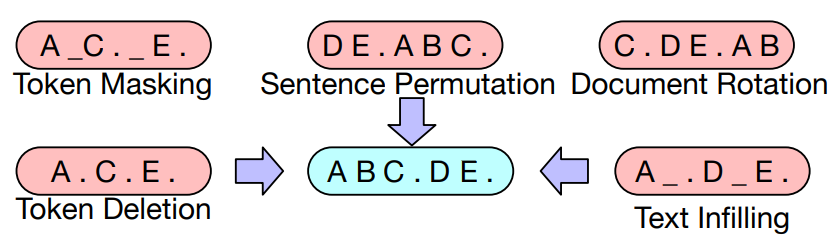
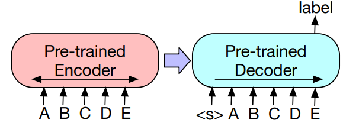

<a href="https://github.com/psf/black"></a>

## BART(**B**idirectional and **A**uto**R**egressive **T**ransformer)



Pretrained KoBART 모델을 활용하여 분류 태스크를 수행합니다. BART는 encoder-decoder 구조를 가지며 text-infilling objective로 pretraining 합니다. sequence classification 태스크에 적용하기 위해서는 아래 그림과 같이 encoder와 decoder에 동일하게 분류하고자 하는 sequence를 넣어주고, decoder의 마지막 단어의 last hidden state를 활용하여 분류합니다. 분류 layer는 `FFNN + Softmax`입니다.



### How to Run

```
conda env create --file environment.yml # 가상환경 생성
python run.py [flags] # train/inference 수행
```

### Dataset

- NSMC : 영화리뷰가 긍정적(0)인지 부정적(1)인지 분류합니다.
- KLUE-tc : KLUE benchmark의 일부로 뉴스 타이틀을 보고 주제를 분류합니다.

### Result

- TBD

